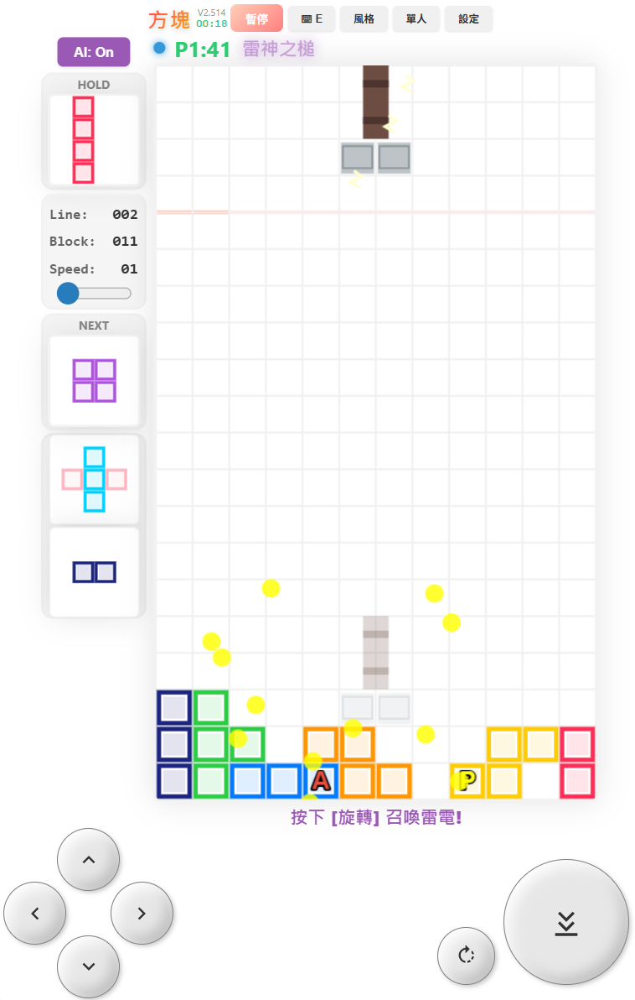
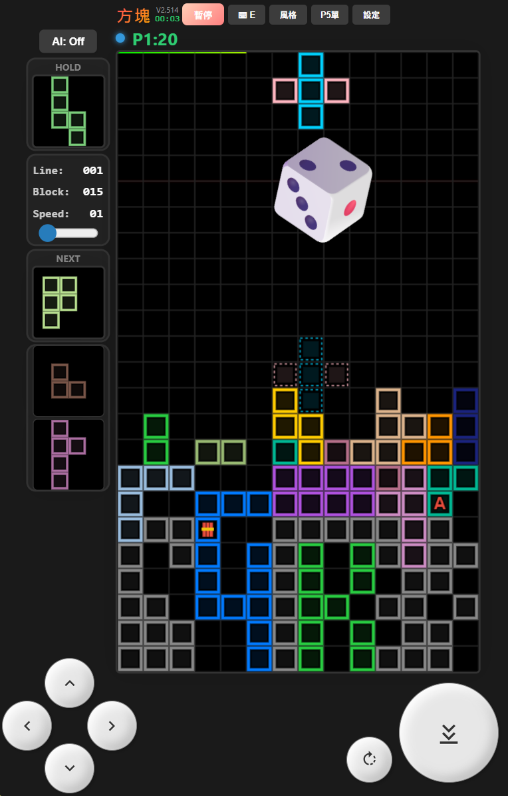
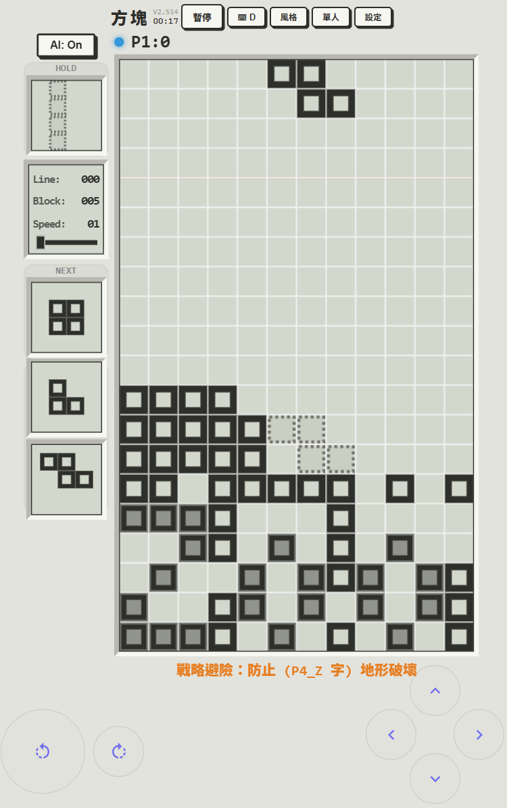

# T-28Block
T-28戰術方塊 Tactical Block: Double-28 Tactical System (28 Blocks &amp; 28 Treasures). Hardcore grid-stacking and line-clearing. Features GAU-8 Cannon, Thor's Hammer, and AI automation. 900KB Vanilla JS+HTML+CSS. | 雙 28 戰術體系：28 種方塊 (2-5格) 堆疊消行 ＋ 28 種戰術寶物。搭載 GAU-8 機砲、雷神之槌、流星雨與 AI 自動化，900KB 原生代碼鑄造。
---
# 🎨 T-28 Tactical Block: Double-28 Tactical System

> **I layout the logic; AI outlines the strokes.**
> **我佈局邏輯願景，AI 勾勒細節筆觸。**
> **我布局逻辑愿景，AI 勾勒细节笔触。**

---

## 🕹️ Project Overview | 專案總覽 | 项目总览

**[ EN ]** T-28Block is a hardcore **block-stacking and line-clearing game** forged with 900KB of pure Vanilla JS+HTML+CSS. 

**[ 繁中 ]** T-28Block 是一款由 900KB 原生 JS+HTML+CSS 鑄造的硬核**方塊堆疊消行遊戲**。

**[ 简中 ]** T-28Block 是一款由 900KB 原生 JS+HTML+CSS 铸造的硬核**方块堆叠消行游戏**。

---

## 🛡️ The Double-28 Architecture | 雙 28 戰術體系 | 双 28 战术体系

### 1. 28 Tactical Blocks | 28 種戰術方塊 | 28 种战术方块
**[ EN ]**
* **Diversity**: From **2-cell extending rods** to 5-cell "P5" heavy dreadnoughts. Includes all 2-5 cell geometric variants.
* **Block Inventory**: Fully customizable block pool. You decide the variety and quantity of blocks to use.
* **Tactical Grid**: Supports **12x20 basic** and **14x24 heavy-duty** (Optimized for P5 units) grids.

**[ 繁中 ]**
* **多樣性**：收錄從**兩格伸縮棒**到 5 格「P5」重裝型單位，涵蓋 2-5 格全系列幾何變體方塊。
* **方塊庫存**：自定義方塊池，由你決定要使用多少種、哪些種類的方塊進行遊戲。
* **戰術網格**：提供 **12x20 基礎網格** 與 **14x24 P5 專用重裝網格**。

**[ 简中 ]**
* **多样性**：收录从**两格伸缩棒**到 5 格「P5」重装型单位，涵盖 2-5 格全系列几何变体方块。
* **方块库存**：自定义方块池，由你决定要使用多少种、哪些种类的方块进行游戏。
* **战术网格**：提供 **12x20 基础网格** 与 **14x24 P5 专用重装网格**。

### 2. 28 Tactical Treasures | 28 種戰術寶物 | 28 种战术宝物
**[ EN ]** A diverse arsenal of 28 items and gear:
* **Assault**: GAU-8 Cannon, **Thor's Hammer (Lightning + Piercing)**, Meteor Shower, and B2~B4 tactical bombs.
* **Support**: **Repair Bird (Gap Filler)**, Drill (Piercing), Cross Laser, and Color Wiper.
* **Special Gear**: Tactical Cross, Extending Rod, Boomerang, and **Enchanted Block P (Holy Light Repair)**.
* **Special Attack**: **Char Attack**, **Dice Attack**: A unique tactical system featuring special block attacks.

**[ 繁中 ]** 具備 28 種功能各異的武裝與裝備：
* **強大火力**：GAU-8 機砲（縱向掃射）、**雷神之槌（雷電+衝破）**、流星雨（隨機轟炸）及 B2~B4 戰術炸彈。
* **支援工具**：**修補鳥（填補空隙）**、鑽頭（強力貫穿）、十字雷射（軸向消除）及同色毀滅。
* **特殊裝備**：戰術十字、伸縮桿、迴旋鏢、**附魔方塊 P（聖光修復）**。
* **戰術打擊**：**字元攻擊 (Char Attack)**、**骰子攻擊 (Dice Attack)**：獨特的特殊方塊攻擊系統。

**[ 简中 ]** 具备 28 种功能各异的武装与装备：
* **强大火力**：GAU-8 机炮（纵向扫射）、**雷神之槌（雷电+冲破）**、流星雨（随机轰炸）及 B2~B4 战术炸弹。
* **支援工具**：**修补鸟（填补空隙）**、钻头（強力贯穿）、十字雷射（轴向消除）及同色毁灭。
* **特殊装备**：战术十字、伸缩杆、回旋镖、**附魔方块 P（圣光修复）**。
* **战术打击**：**字符攻击 (Char Attack)**、**骰子攻击 (Dice Attack)**：独特的特殊方块攻击系统。

---

## 🧠 Intelligence & Mechanics | 智能與機制 | 智能与机制

**[ EN ]** * **2-Ply AI Automation**: Features a high-performance **2-ply lookahead algorithm** that evaluates current and subsequent block placements.
* **Progress Control**: Integrated **Save/Load** system to resume your progress. Real-time adjustment of **speed and difficulty** at any time.
* **Dual-Pilot**: Optimized for local P1/P2 combat. Supports **garbage lines, character attacks, and dice random attacks**.
* **Visual Styles**: Quick switch between **Dark, Light, Extra-light and LCD Retro modes** for optimal environmental contrast, and **Type A~E virtual button layouts**.
* **Tactical Reward**: Boost drop rates via combos, earn **B2~B4 bombs** through multi-line clears, and trigger ultimate moves via accumulation.

**[ 繁中 ]** * **2-Ply AI 自動化**：內建高性能 **2-ply 預測演算法**，能同時運算當前與下一手方塊的最佳位置，實現精準的堆疊決策。
* **進度掌控**：支援**儲存/載入 (Save/Load)** 遊戲進度，並可在遊玩過程中**隨時調整速度與難度**。
* **雙人對戰**：專為 P1/P2 本地對戰優化，支援互丟**垃圾行、字元與骰子隨機攻擊**。
* **視覺風格**：提供**深色、淺色、極淺、LCD 復古**四種模式快速切換，適應不同環境色彩需求。並可循環切換 **Type A~E 五種螢幕虛擬按鍵佈局**。
* **戰術獎勵**：連擊提升掉寶率（Combo）、多行消除獲取 **B2~B4 戰術炸彈**，並藉由累積消行與方塊數來觸發強力大招。

**[ 简中 ]** * **2-Ply AI 自动化**：内建高性能 **2-ply 预测算法**，能同时运算当前与下一手方块的最佳位置，实现精准的堆叠决策。
* **进度掌控**：支持**存档/载入 (Save/Load)** 游戏进度，并可在游玩过程中**随时调整速度与难度**。
* **双人对战**：专为 P1/P2 本地对战优化，支持互丢**垃圾行、字符与骰子随机攻击**。
* **视觉风格**：提供**深色、浅色、极浅、LCD 复古**四种模式快速切换，适应不同环境色彩需求，并可循环切换 **Type A~E 五种屏幕虚拟按键布局**。
* **战术奖励**：连击提升掉宝率（Combo）、多行消除获取 **B2~B4 战术炸弹**，并藉由累积消行与方块数来触发強力大招。

---

## 📜 Project Notes & Ethics | 開發者守則 | 开发者守则

**Personal Non-Profit Research | 個人非營利研究 | 个人非营利研究**

* **[ EN ]** This is a personal project for technical research. Please do not use it for commercial profit or advertisements.
* **[ 繁中 ]** 本專案為個人技術研究與邏輯實驗。請勿將其用於任何商業盈利行為或廣告推廣。
* **[ 简中 ]** 本项目为个人技术研究与逻辑实验。请勿将其用于任何商业盈利行为或广告推广。

---

## ☕ Support Me | 贊助支持 | 赞助支持

👉 **[Support me on Portaly | 前往 Portaly 贊助我](https://portaly.cc/skyuns)**

---
淺色模式+Type E按鍵

深色模式+Type E按鍵

LCD 模式+Type D按鍵

---
*T-28 Tactical Block: Stacking with logic, clearing with fire.*
